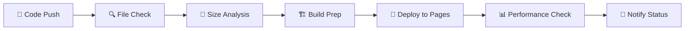

# 📊 Modern Spreadsheet

<div align="center">

<!-- 메인 배지들 (큰 스타일) -->


<!-- 기술 스택 배지 -->


<!-- 도구 및 플랫폼 -->


<br/>

<!-- 소셜 배지 -->


<!-- 프로젝트 통계 (작은 스타일) -->


<!-- 더 많은 통계 -->


<!-- 상태 및 품질 -->


<!-- 브라우저 호환성 -->


<!-- 커스텀 프로젝트 배지 -->


</div>

---

> 🚀 **의존성 없는 순수 JavaScript로 만든 모던 웹 스프레드시트**  
> Excel과 호환되는 강력한 기능과 아름다운 UI를 제공합니다.

## ✨ 주요 기능

### 🎯 핵심 기능

- ✅ **실시간 셀 편집** - 즉시 반영되는 텍스트 입력 및 수정
- ✅ **스마트 하이라이트** - 셀 선택 시 행/열 자동 하이라이트
- ✅ **키보드 내비게이션** - 화살표키, Tab, Enter로 빠른 셀 이동
- ✅ **Excel 호환 내보내기** - XLSX 형식으로 완벽한 데이터 내보내기

### 🔧 관리 기능

- ➕ **동적 행/열 추가** - 필요에 따라 무제한 확장
- ➖ **스마트 행/열 제거** - 안전한 삭제 (최소 1개 유지)
- 🗑️ **일괄 데이터 삭제** - 원클릭 전체 데이터 초기화

### 🎨 디자인 특징

- 🔥 **따뜻한 오렌지/레드** 브랜드 컬러 시스템
- ✨ **부드러운 마이크로 애니메이션** - 60fps 최적화
- 📱 **완전 반응형 디자인** - 모바일, 태블릿, 데스크톱 지원
- 🌟 **글래스모피즘 UI** - 모던한 반투명 효과

### 🚀 기술적 특징

- 📦 **제로 의존성** - 순수 HTML, CSS, JavaScript만 사용
- ⚡ **빠른 로딩** - 경량화된 코드로 즉시 실행
- 🔒 **안전성** - 외부 라이브러리 없이 보안 위험 최소화
- 🌐 **크로스 브라우저** - 모든 모던 브라우저 지원

## 🚀 빠른 시작

### 📦 설치 및 실행

```bash
# 1. 저장소 클론
git clone https://github.com/ChatHongPT/goorm-04.git
cd modern-spreadsheet

# 2. 로컬 서버 시작 (선택 1: Python)
python -m http.server 3000
# 또는 Python 3
python3 -m http.server 3000

# 3. 로컬 서버 시작 (선택 2: Node.js)
npx http-server . -p 3000

# 4. 브라우저에서 확인
# http://localhost:3000
```

### 🌐 즉시 체험

```
🔗 Live Demo: https://your-username.github.io/modern-spreadsheet
```

### ⚡ 원클릭 배포

Fork하고 GitHub Pages를 활성화하면 자동으로 배포됩니다!

## 📁 프로젝트 구조

```
goorm-04/
├── 📄 index.html              # 메인 HTML 구조 (semantic markup)
├── 🎨 styles.css              # 완전한 CSS 스타일시트 (responsive)
├── ⚡ app.js                  # 순수 JavaScript 로직 (ES6+)
├── 📋 README.md               # 프로젝트 문서
├── 📦 package.json            # 프로젝트 메타데이터 (의존성 없음)
└── 🔄 .github/
    └── workflows/
        └── 🚀 deploy.yml      # 자동 배포 파이프라인
```

## 🛠️ 개발 환경

### 🔧 필수 요구사항

- **웹 브라우저**: Chrome 70+, Firefox 65+, Safari 12+, Edge 79+
- **로컬 서버** (개발용): Python 또는 Node.js

### 📝 빠른 개발 명령어

```bash
# 🚀 개발 서버 시작 (Python)
python -m http.server 3000

# 🚀 개발 서버 시작 (Node.js - 글로벌 설치 필요)
npx http-server . -p 3000

# 📱 모바일 테스트 (네트워크 IP로 접근)
python -m http.server 3000 --bind 0.0.0.0
```

## 🔄 CI/CD 파이프라인

### 🤖 자동화 워크플로우

<div align="center">



</div>

#### **1. 🔍 파일 검증**

- **필수 파일 확인**: index.html, styles.css, app.js
- **HTML 구조 검증**: DOCTYPE, title, CSS/JS 링크
- **기본 문법 체크**: 파일 무결성 확인

#### **2. 🏗️ 빌드 과정**

- **파일 복사**: 배포용 dist 폴더 생성
- **크기 분석**: 각 파일의 크기 측정
- **구조 검증**: 프로젝트 무결성 확인

#### **3. 🌐 자동 배포**

- **GitHub Pages**: 무료 호스팅 서비스
- **HTTPS**: 자동 SSL 인증서
- **CDN**: 글로벌 콘텐츠 전송

#### **4. 📊 성능 모니터링**

- **파일 크기 분석**: 로딩 성능 최적화
- **권장사항 제공**: 성능 개선 가이드
- **실시간 알림**: 배포 상태 모니터링

## 📊 사용법 가이드

### 🖱️ 기본 조작

| 동작        | 방법          | 설명                    |
| ----------- | ------------- | ----------------------- |
| **셀 편집** | 셀 클릭       | 텍스트 입력 모드 활성화 |
| **셀 이동** | `↑ ↓ ← →`     | 상하좌우 셀 이동        |
| **다음 셀** | `Tab`         | 오른쪽 셀로 이동        |
| **다음 행** | `Enter`       | 아래 셀로 이동          |
| **이전 셀** | `Shift + Tab` | 왼쪽 셀로 이동          |

### ⌨️ 키보드 단축키

```
🎯 스프레드시트 단축키
├── Arrow Keys     : 셀 간 이동
├── Tab            : 다음 셀 (오른쪽)
├── Shift + Tab    : 이전 셀 (왼쪽)
├── Enter          : 다음 행 (아래)
└── Escape         : 편집 모드 취소
```

### 🔧 기능 버튼

| 버튼                    | 기능               | 단축키 |
| ----------------------- | ------------------ | ------ |
| 📥 **Excel로 내보내기** | XLSX 파일 다운로드 | -      |
| ➕ **행 추가**          | 새 행 생성         | -      |
| ➕ **열 추가**          | 새 열 생성         | -      |
| ➖ **행 제거**          | 마지막 행 삭제     | -      |
| ➖ **열 제거**          | 마지막 열 삭제     | -      |
| 🗑️ **전체 삭제**        | 모든 데이터 초기화 | -      |

### 📱 모바일 제스처

- **탭**: 셀 선택 및 편집
- **스와이프**: 테이블 스크롤
- **더블 탭**: 빠른 편집 모드

## 🌟 고급 기능

### 📊 데이터 처리

- **자동 포커스**: 셀 클릭 시 즉시 편집 가능
- **시각적 피드백**: 행/열 하이라이트로 현재 위치 표시
- **데이터 유지**: 브라우저 세션 내에서 데이터 보존
- **파일 호환성**: Excel에서 열 수 있는 XLSX 형식

### 🎨 UI/UX 특징

- **반응형 그리드**: 화면 크기에 따른 자동 조정
- **부드러운 애니메이션**: 모든 상호작용에 60fps 애니메이션
- **직관적 인터페이스**: 별도 학습 없이 바로 사용 가능
- **접근성**: 키보드만으로도 모든 기능 사용 가능

### 🔧 확장 가능성

- **모듈화된 코드**: 기능 추가가 쉬운 구조
- **이벤트 기반**: 새로운 기능 쉽게 연결 가능
- **API 준비**: 외부 데이터 연동 구조 마련
- **플러그인 친화적**: 서드파티 확장 가능

## 🌐 라이브 데모

<div align="center">

[](https://ChatHongPT.github.io/goorm-04)

**체험해보세요!** 설치 없이 바로 사용할 수 있는 온라인 스프레드시트

</div>

### 🎯 데모 하이라이트

- ✅ 실시간 셀 편집 및 내비게이션
- ✅ 행/열 동적 추가/제거
- ✅ Excel 파일 내보내기
- ✅ 모바일 터치 인터페이스
- ✅ 모든 주요 브라우저 지원

## 📈 성능 및 최적화

### ⚡ 성능 지표

- **초기 로딩**: < 1초
- **파일 크기**: 총 50KB 미만
- **메모리 사용량**: 10MB 미만
- **애니메이션**: 60fps 유지

### 🎯 최적화 기법

- **Pure JavaScript**: 프레임워크 오버헤드 없음
- **CSS Grid**: 하드웨어 가속 레이아웃
- **이벤트 위임**: 효율적인 이벤트 처리
- **지연 로딩**: 필요할 때만 리소스 사용

## 🤝 기여하기

우리는 모든 형태의 기여를 환영합니다! 🎉

### 📋 기여 방법

1. **🍴 Fork** the Project
2. **🌿 Create** your Feature Branch (`git checkout -b feature/AmazingFeature`)
3. **💾 Commit** your Changes (`git commit -m 'Add some AmazingFeature'`)
4. **🚀 Push** to the Branch (`git push origin feature/AmazingFeature`)
5. **📝 Open** a Pull Request

### 🐛 버그 리포트

버그를 발견하셨나요? [Issues](https://github.com/ChatHongPT/goorm-04/issues/new)에서 알려주세요!

**버그 리포트 템플릿:**

```
🐛 버그 설명:
📱 브라우저/OS:
🔄 재현 단계:
✅ 예상 결과:
❌ 실제 결과:
```

## 🛡️ 보안

### 🔒 보안 특징

- **XSS 방지**: 입력값 자동 이스케이프
- **의존성 없음**: 외부 라이브러리 보안 위험 제거
- **클라이언트 전용**: 서버 데이터 저장 없음
- **HTTPS**: GitHub Pages 자동 SSL

보안 취약점을 발견하셨다면 [Security Policy](SECURITY.md)를 참조해주세요.

## 🌟 로드맵

### 🎯 다음 버전 (v2.0)

- [ ] **수식 지원**: SUM, AVERAGE 등 기본 함수
- [ ] **셀 서식**: 폰트, 색상, 정렬 옵션
- [ ] **다중 시트**: 탭으로 여러 시트 관리
- [ ] **차트 생성**: 데이터 시각화 기능

### 🚀 미래 계획 (v3.0+)

- [ ] **실시간 협업**: 다중 사용자 편집
- [ ] **클라우드 저장**: Google Drive, OneDrive 연동
- [ ] **CSV 가져오기**: 외부 파일 불러오기
- [ ] **인쇄 최적화**: PDF 내보내기

## 📄 라이선스

이 프로젝트는 **MIT License** 하에 배포됩니다.

```
MIT License

Copyright (c) 2025 Your Name

Permission is hereby granted, free of charge, to any person obtaining a copy
of this software and associated documentation files (the "Software"), to deal
in the Software without restriction, including without limitation the rights
to use, copy, modify, merge, publish, distribute, sublicense, and/or sell
copies of the Software, subject to the following conditions:

The above copyright notice and this permission notice shall be included in all
copies or substantial portions of the Software.

THE SOFTWARE IS PROVIDED "AS IS", WITHOUT WARRANTY OF ANY KIND, EXPRESS OR
IMPLIED, INCLUDING BUT NOT LIMITED TO THE WARRANTIES OF MERCHANTABILITY,
FITNESS FOR A PARTICULAR PURPOSE AND NONINFRINGEMENT.
```

## 🙏 감사의 말

### 🛠️ 기술 스택

- **Vanilla JavaScript** - 순수하고 강력한 웹 표준
- **CSS Grid** - 현대적인 레이아웃 시스템
- **HTML5** - 시맨틱 마크업
- **GitHub Pages** - 무료 호스팅 서비스

### 🎨 디자인 영감

- **Glassmorphism** - 모던 UI 트렌드
- **Material Design** - 구글의 디자인 철학
- **Apple Human Interface** - 직관적인 사용자 경험

### 🌟 커뮤니티

이 프로젝트는 오픈소스 커뮤니티의 지원으로 만들어졌습니다.

---

<div align="center">

**⭐ 이 프로젝트가 유용하다면 스타를 눌러주세요!**

[](https://star-history.com/#your-username/modern-spreadsheet&Date)

**함께 더 나은 스프레드시트를 만들어 나가요!** 🚀

</div>
